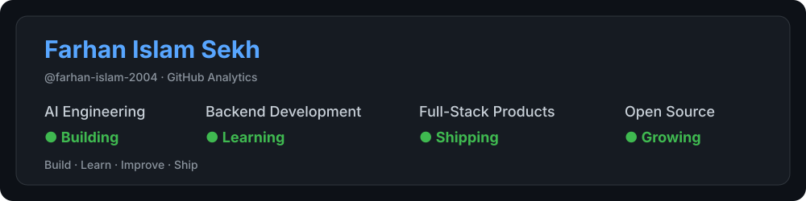

  

 

---

## 👨‍💻 Who I Am

I'm a **final-year BTech Computer Science student at Brainware University** focused on **AI engineering, backend development, and full-stack product development**.

I like going beyond tutorials — I enjoy taking an idea, designing the architecture, building the application, integrating AI/APIs, testing it, and turning it into something people can actually use.

- 🐍 **Backend:** Python, FastAPI, Flask, REST APIs, authentication
- ⚛️ **Frontend:** React, Vite, TypeScript, JavaScript, Tailwind CSS
- 🗄️ **Data:** MongoDB, MySQL
- 🤖 **AI/NLP:** LLMs, NLP, GenAI, embeddings, vector search, AI-assisted applications
- 🧠 **Problem Solving:** Python DSA + LeetCode
- 🚀 **Long-term:** build products, launch a startup, and create technology with real-world impact

> **My current mission:** become a strong software engineer who can build intelligent, production-ready products end-to-end.

---

## 🚀 What I'm Building

### 🧮 MathVerse AI

**An AI-powered mathematical problem-solving platform designed to make solving, understanding, and practicing mathematics more interactive.**

MathVerse AI combines a **deterministic mathematical solver engine** with AI-assisted reasoning and a modern full-stack interface. The goal is not only to produce an answer, but to help users understand **how and why** a problem is solved.

#### ✨ Core Features

- 🧮 **Math Keyboard** — an interactive input experience for mathematical expressions
- 🔐 **User Accounts** — authentication and personalized user experience
- 🧾 **Calculation History** — previous calculations can be stored and revisited
- 📐 **Solver Engine** — dedicated solving workflows for mathematical problems
- 🪜 **Step-by-Step Solutions** — detailed derivations instead of answer-only output
- 🧠 **Reasoning Engine** — structured AI-assisted reasoning across different learning modes
- 📚 **Practice & Concepts** — designed to support learning, practice, and mathematical understanding
- 📱 **Modern Responsive UI** — dark glassmorphism interface with animated interactions

---

## 🧰 Technology

<table>
<tr>
<td align="center" width="33%"><strong>💻 Languages</strong>  

</td>
<td align="center" width="33%"><strong>🎨 Frontend</strong>  

</td>
<td align="center" width="33%"><strong>⚙️ Backend</strong>  

</td>
</tr>
<tr>
<td align="center"><strong>🗄️ Databases</strong>  

</td>
<td align="center"><strong>🤖 AI & Mathematics</strong>  
<strong>LLMs · NLP · GenAI · SymPy</strong>
</td>
<td align="center"><strong>🛠️ Tools</strong>  

</td>
</tr>
</table>

 

---

## 🏆 Journey & Highlights

<table>
<tr>
<th>Chapter</th>
<th>Experience</th>
<th>What I Took From It</th>
</tr>

<tr>
<td>💼 <strong>Samsung Innovation Campus</strong></td>
<td>Technology-focused learning and hands-on exposure</td>
<td>Built a stronger foundation and learned to approach technology through practical problem solving.</td>
</tr>

<tr>
<td>🐍 <strong>BroskiesHub</strong></td>
<td>Python Developer Intern</td>
<td>Moved from learning concepts to applying Python in real development work.</td>
</tr>

<tr>
<td>🌐 <strong>Int.kart</strong></td>
<td>Co-founder / Developer-Marketing</td>
<td>Learned that building a product also means understanding users, communication, and execution.</td>
</tr>

<tr>
<td>🌟 <strong>India's Top 1000 Innovators 2025</strong></td>
<td>Innovation recognition</td>
<td>A milestone that reinforced my interest in turning technical ideas into useful solutions.</td>
</tr>

<tr>
<td>📚 <strong>Springer Nature</strong></td>
<td>Abstract accepted for an edited volume</td>
<td>Connected my technical work with research, documentation, and academic communication.</td>
</tr>

</table>

 

<table>
<tr>
<td><strong>Then</strong></td>
<td>Learning technology and experimenting with ideas</td>
</tr>
<tr>
<td><strong>Now</strong></td>
<td>Building AI-powered, full-stack products with stronger engineering practices</td>
</tr>
<tr>
<td><strong>Next</strong></td>
<td>Keep building, deepen backend & AI engineering, and turn ideas into products</td>
</tr>
</table>

---

## 🌍 Learning Beyond Code

In 2026, I've been actively exploring how modern AI is changing the way software is built.

- 🤖 **GEN AI Camp — AlgoUniversity:** Generative AI, multimodal AI, embeddings, vector search and AI product design
- 🌐 **Google I/O Extended Kolkata 2026:** AI-assisted SRE, agentic AI, context engineering and modern AI workflows
- 🧠 **Build with AI Bootcamp — Google for Developers:** Google AI Studio, Gemini, AI agents and deployable AI applications
- 🔐 **CyberOps Associate — Cisco Networking Academy**

These experiences have reinforced one idea:

> **Don't just learn technology. Build with it.**

---

## 📈 What I'm Focused On Right Now

**DSA** → **Backend Engineering** → **AI Engineering** → **Full-Stack Products** → **Production Readiness**

- 🧠 Solving **Python DSA / LeetCode** problems consistently
- ⚙️ Deepening backend skills in **APIs, authentication, databases, testing and system design**
- 🤖 Building practical **AI/GenAI applications**
- 🧪 Improving **security, testing, documentation and maintainability**

---

## 📊 GitHub Analytics

  

<table>
<tr>
<td width="50%" align="center">

</td>
<td width="50%" align="center">

</td>
</tr>
</table>

 

---

## 💡 My Developer Philosophy

### **Build → Break → Learn → Improve → Ship**

I believe the best way to learn software engineering is to **build real things, solve real problems, and keep improving them.**

---

## 🤝 Let's Connect

I'm open to connecting with developers, builders, mentors, recruiters, and people working on **AI, backend engineering, full-stack development, and meaningful technology products**.

  

Build. Grow. Ship. 🚀

